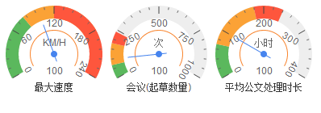

# gauge
一个 Raphaël 仪表盘控件




## Example
```html
<div id="gauge1" class="gauge-item"></div>
```

```js
var gauge = new Gauge({
	container: 'gauge1',
	title: '平均速度',
	unit: 'km/h',
	width: 120,
	height: 120,
	radius: 60,
	maxValue: options.maxValue,
	minValue: options.minValue,
	value: 80,

	greenFrom: 0,
	greenTo: 70,

	yellowFrom: 70,
	yelloTo: 180,

	redFrom: 180,
	redTo: 240,

	onclick: function(opt) {
		alert(opt.title)
	}
})

gauge.draw();
```
